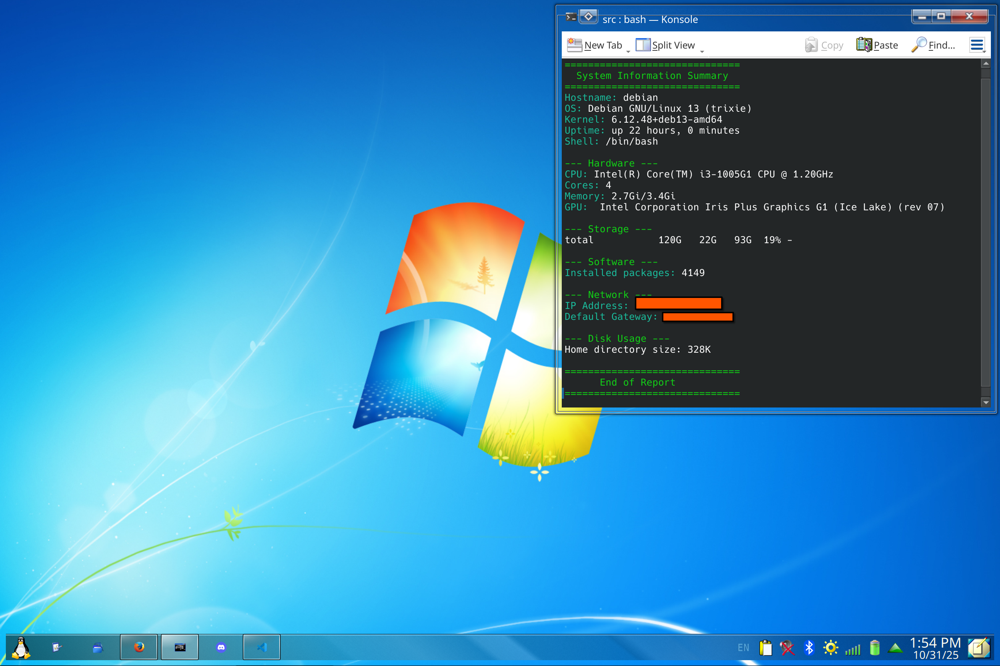

# sysinfo.sh

to run on debian 13 go to youf file manager > right click > make executeable

then...


```bash
    $ sudo ./sysinfo.sh
```

done!!

## DEMO:



## Tested on....

- Debian 13 (works completely fine, no issues)
- Fedora 41 & 42 (works with minor issues)